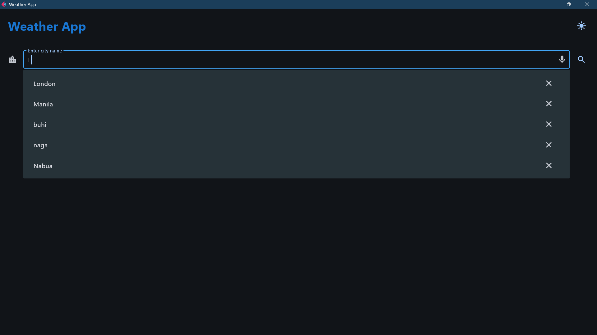
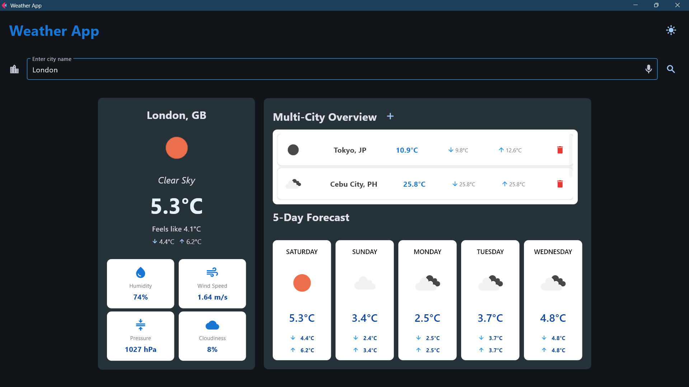
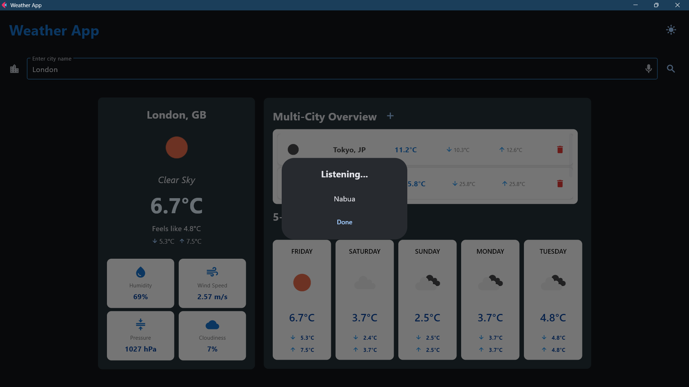

# Weather Application - Module 6 Lab

## Student Information
- **Name**: Ven John Rey Lavapie
- **Student ID**: 231002321
- **Course**: CCCS 106
- **Section**: BSCS 3A

## Project Overview
This weather app shows users current weather and weather predictions for various cities. Users can search any city and see current conditions and temperature, track multiple locations, get a 5-day forecast, and compare different cities weather. The app focuses on user-friendliness and interactivity, allowing users to add and remove locations, and automatically loading their saved cities. Using real-time information from OpenWeatherMap, this app design helps users see their daily or weekly plans in a clean, user responsive way.


## Features Implemented

### Base Features
- [x] City search functionality
- [x] Current weather display
- [x] Temperature, humidity, wind speed, pressure, cloudiness
- [x] Weather icons
- [x] Error handling
- [x] Modern UI with Material Design

### Enhanced Features
1. **5-day weather forecast**
   - The 5-day forecast feature shows users the upcoming weather for the next five days. This feature shows the weather, temperature, minimum temperature, and maximum temperature.
   - I chose to include this feature because most people rely on short-term forecasts, and it makes the app feel more useful and complete.
   - One challenge I ran into was turning the raw API data into clear day-by-day information, and I solved it by carefully grouping the hourly results into organized daily weather forecasst.

2. **Multi-city overview**
   - This let users track and compare weather from other cities at once in a clean and personalized dashboard.
   - I choose this feature for convience of user whenever they want to compare the weather from several locations. Additionaly, this features makes the app more practical.
   - A challenge was that user input reset on app close, so I solved it by storing the entered cities in a JSON file.

## Screenshots





## Installation

### Prerequisites
- Python 3.8 or higher
- pip package manager

### Setup Instructions
```bash
# Clone the repository
git clone https://github.com/ven-62/cccs106-projects.git
cd cccs106-projects/mod6_labs

# Create virtual environment
python -m venv venv
source venv/bin/activate  # On Windows: venv\Scripts\activate

# Install dependencies
pip install -r requirements.txt

# Create .env file
cp .env.example .env   # On Windows: copy .env.example .env
# Add your OpenWeatherMap API key to .env