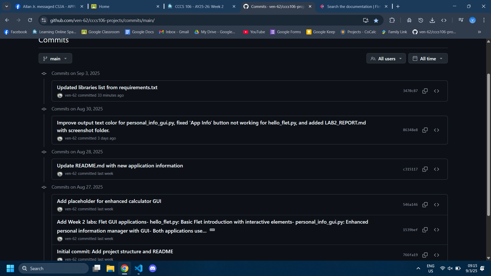

# Lab 2 Report: Git Version Control and Flet GUI Development

**Student Name:** Ven John Rey C. Lavapie\
**Student ID:** 231002321\
**Section:** BSCS 3A\
**Date:** August 30, 2025

## Git Configuration

### Repository Setup
- **GitHub Repository:** https://github.com/ven-62/cccs106-projects.git
- **Local Repository:** ✅ Initialized and connected
- **Commit History:** 6 commits with descriptive messages

### Git Skills Demonstrated
- ✅ Repository initialization and configuration
- ✅ Adding, committing, and pushing changes
- ✅ Branch creation and merging
- ✅ Remote repository management

## Flet GUI Applications

### 1. hello_flet.py
- **Status:** ✅ Completed
- **Features:** Interactive greeting, student info display, dialog boxes
- **UI Components:** Text, TextField, Buttons, Dialog, Containers
- **Notes:** "App Info" button not working; fixed by adding `page.open(dialog)`. Adjusted to window height from 400 to 600,  and changed the  page theme from light to dark.

### 2. personal_info_gui.py
- **Status:** ✅ Completed
- **Features:** Form inputs, dropdowns, radio buttons, profile generation
- **UI Components:** TextField, Dropdown, RadioGroup, Containers, Scrolling
- **Error Handling:** Input validation and user feedback
- **Notes:** Enhanced output and clear text color; added age validation; fixed error dialog not in display.

## Technical Skills Developed

### Git Version Control
- Understanding of repository concepts
- Basic Git workflow (add, commit, push)
- Branch management and merging
- Remote repository collaboration

### Flet GUI Development
- Flet 0.28.3 syntax and components
- Page configuration and layout management
- Event handling and user interaction
- Modern UI design principles

## Challenges and Solutions

At first run, flet isn't working; solution, I run `pip install flet[all]` on the terminal.

## Learning Outcomes

 I learned that using version control, like Git, help me to develop program that I've modified before and work with it without affecting the other code. With this, I can experiment and test what works best for the project I'm working on and apply it for future use. For GUI development, like using flet for Python, I learned to do some basic user interface, and I've realized that developing a GUI for a user's smooth experience is challenging. Lastly, collaborative programming is useful for big projects where many programmer collaborate to code, share ideas, and fix bug together to make a functional application/software.

## Screenshots

### Git Repository
-  
- 

### GUI Applications
`hello_flet.py`
-  
-  

`personal_info_gui.py`
-  
-  

## Future Enhancements

For both `hello_flet.py` and `personal_info_gui.py`, I would suggest adding a theme toggle and real-time features like a live clock to make the apps more interactive. It could also be improved by enabling profile saving, photo upload, and merging them into a single student portal with simple navigation.
